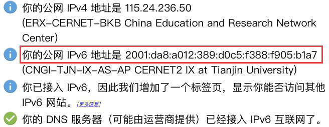
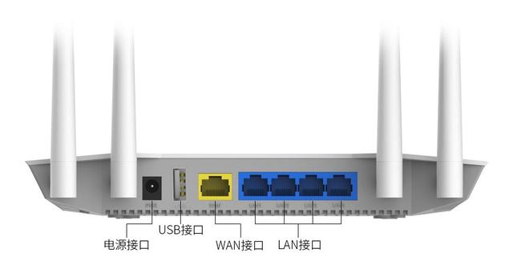
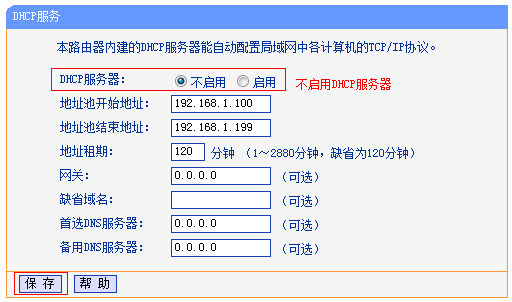
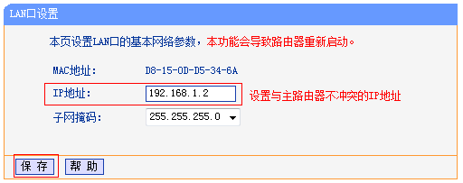
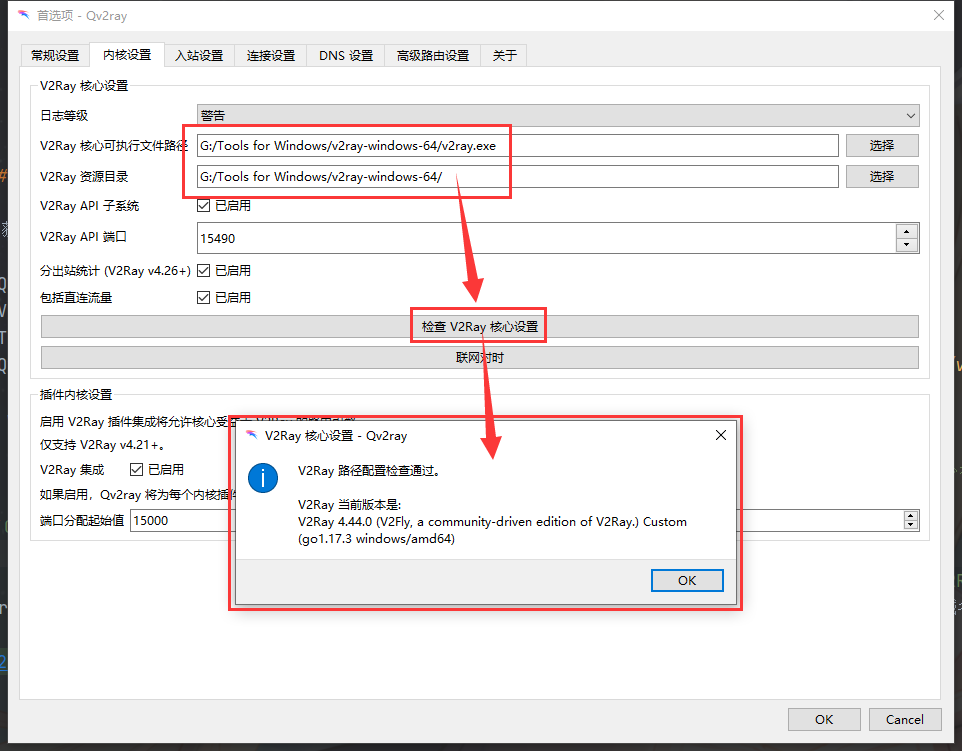
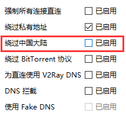
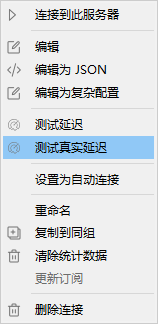
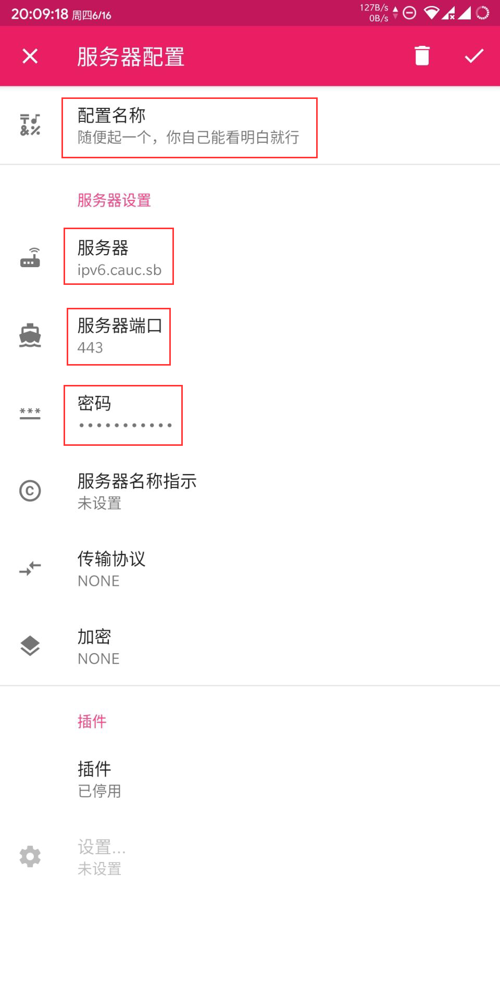

!!! abstract "摘要"

    在某些校园网计费系统中，IPv6 地址是不计入校园网流量的。这里提供了一种方法，可以通过架设 IPv6 代理绕过校园网计费系统，从而实现免流上网。

## 第 1 章 免流理论基础

!!! tip "提示"

    如果你的同学有按照此教程搭建的现成的免流服务器，那你阅读完这一章之后可以直接跳过并快进到 [3.3 配置客户端（Client）](#33-client)，并向他们询问相关的配置方法。

    如果你周围没有任何同学按此教程搭建服务器，或者你想从零开始完全动手自建一个属于自己的免流服务器，那你可能需要全文阅读。

### 1.1 前言和准备

在开始之前，你需要：

 - [x] IPv6 公网（见 [1.3 IPv6 环境](#13-ipv6)）
 - [x] 能顺利访问 [GitHub](https://github.com/)（对于 Android 和 Windows 10 用户）
 - [x] 拥有一个**非国区** iCloud 账号及其支付方式（对于iOS/iPad OS用户）

如果你是**从零开始**自建，那你还需要：

 - [x] 一台云服务器
 - [x] 一个域名以及该域名对应的证书

我假设你已经：

 - [x] 了解基本的 Linux 操作知识（不自建或者用 Windows 自建的可无视）
 - [x] 了解基本的**搭建网站的基本流程**
 - [x] 了解基本的**计算机网络基础知识**及其**常见英语名词释义**
 - [x] 了解基本的 GitHub 使用方法
 - [x] 拥有 [CET4](http://cet.neea.edu.cn/cet/) 证书，并且笔试成绩至少为 425 分（或在其他测试中取得同等效力的成绩）

!!! danger "在阅读以下教程之前..."

     - 如果有图，***请不要直接照着图抄***，可能会有小改的地方。
     - 如果有代码，***请不要直接照着代码抄***，可能会有小改的地方。

### 1.2 原理

第二代中国教育和科研计算机网（CERNET2，俗称教育网或二代教育网），采用主干网和用户网二级结构，主干网采用纯 IPv6 协议，也是中国第一个 IPv6 国家主干网。目前众多高校都已经接入了 CERNET2 主干网。

在大部分高校中，采用的是 Dr.COM（城市热点）认证系统。由于目前**该系统尚不计入 IPv6 的流量**，而且 CERNET2 主干网刚好是纯 IPv6 网络，因此可以通过 CERNET2 连接到代理服务器（Proxy Server），用这个服务器代理我们所有的流量，实现绕过（Bypass）校园网计费系统。

事实上，如果你不使用代理服务器，而你访问的网站是纯 IPv6 网站的话，同样也不会被校园网计费系统收取流量费。如图：

``` mermaid
graph LR

    You[你] --> Gateway{网关}
    Gateway -->|IPv4| Billing[校园网计费系统]
    Gateway ==>|IPv6| Proxy[代理服务器]
    Gateway -->|IPv6| Internet[校外网络]
    Proxy ==>|IPv4 或 IPv6| Internet
    Billing -->|IPv4| Internet
    
```

说得通俗点，我们要通过校园网访问某个网站，会先把“我要访问某个网站”这个请求（Request）通过 IPv6 发往代理服务器，由代理服务器代替我们完成这个请求。代理服务器完成 `我要访问某个网站` 的请求之后会得到网站的一个响应（Response），它再将这个响应通过 IPv6 发回我们的设备。

对校园网而言，通信全程是靠 IPv6 实现的，因此不会被校园网系统计费。我们没有被校园网系统计费就实现了对某个网站的访问，因此对我们设备而言，就实现了免流访问。

以中国民航大学（CAUC）为例，其已经接入了 CERNET2，与天津音乐学院、天津中医药大学等高校共享带宽（不过好像是初代 CERNET？）。校内采用 Dr.COM 城市热点计费系统，校园网计费价格为**仅按流量计费，价格为 0.5 元/GB**。因其不合理的价格 ~~（甚至有传说说中国民航大学的校园网是白嫖的别人高校（疑似北京大学？）的剩余带宽，你白嫖这还向学生收费，这我不能忍）~~ 我们决定设法绕过其计费系统。

!!! note "校园网流量单价变更历史"

    根据 “航大信息网络" 公众号，从 2021 年 4 月 28 日起，校园网计费标准从 1 元/GB 下调至 0.5 元/GB。

    2022 年 4 月 1 日，校园网计费标准再次发生变动，教学办公区域（如教室、办公室、图书馆）流量单价变更为 0.25 元/GB，其他区域流量单价保持 0.5 元/GB 不变。

??? cite "关于校园网计费策略调整的通知（高血压，慎点开）"

    关于校园网计费策略调整的通知

    各位校园网用户：

    为更好支撑学校的教学、科研、管理、服务工作，通过对部分高校网络收费标准调研，结合我校实际情况，按照校园网收费对学生逐年降低，***收费标准不高于天津市其他高校平均水平的总原则***。经学校审批，对校园网计费策略进行如下调整：

     - 疫情防控期间，全体教职工和学生每人每月 60 GB 免费上网流量，本月开始执行，恢复常态教学模式后结束，免费流量当月有效，本月已发放。
     - 恢复常态教学模式后，教职工每人每月 40 GB 免费上网流量，学生每人每月 10 GB 免费上网流量，免费流量当月有效。
     - 自 4 月 1 日起，教职工及学生超出免费流量，使用教学区、办公区等非学生宿舍的无线校园网，按照现行网络收费标准的一半，即 0.25 元/GB 计费。
     - 教职工及学生超出免费流量，使用全校范围有线网络及学生宿舍的无线校园网，仍按现行标准 0.5 元/GB 收费。
     - 校内资源、校外 IPv6 资源及已申请直通的校外教学资源仍免计费。

    信息网络中心

    2022 年 3 月 23 日

本文介绍的是通过 Trojan-Go 来实现网络代理，因为其搭建代理服务器的可靠性很高，不容易被发现。实际上你可以采用任何的代理形式，不局限于 Trojan-Go。至于其他的代理形式，请自行了解，本文不讨论。

### 1.3 IPv6 环境

你首先需要一个完全的公网 IPv6 访问权限。对于中国民航大学校内学生而言，请**先登录校园网**后再继续下一步。

请访问 https://www.test-ipv6.com/ ，并检查 `你的公网IPv6地址是` 这一项是否有 IPv6 地址。



如果有，那就可以直接进入 [第 2 章](#2)。

如果没有，请先尝试多次刷新，如果不行，那就换一个连接校园网的方法，**尤其是在宿舍使用路由器的情况**。对于一些落后的无线路由器，其 NAT（网络地址转换）并不提供对 IPv6 的支持，你需要自己了解自己的路由器是否支持。

即便是对于这种已过时的路由器，我们也是有一个通用办法可以解决的，那就是将路由器以接入点模式运行。

??? help "如何将路由器以接入点模式运行"

     - 将插入路由器 WAN 接口的网线拔出，然后插入任意一个 LAN 接口。

       

     - 关闭路由器的 DHCP 功能。（必须关闭，否则你的路由器会对客户端分配错误的 IP 地址）

       

     - 将路由器 LAN 口地址改为和上一级网络设备在同一网段但不冲突。（可选，如果你看不懂这句话什么意思可以跳过）

       

     - 重启路由器。

关于如何将路由器以接入点模式运行，你也可以参考其他的资料：

 - [[传统界面路由器] 当无线AP（无线交换机）使用，怎么设置？](https://service.tp-link.com.cn/detail_article_451.html)
 - [无线路由器是否可以作为无线交换机使用？](https://www.zhihu.com/question/20432528)
 - [路由器 AP、路由、中继、桥接模式的区别](https://zhuanlan.zhihu.com/p/32275116)

## 第 2 章 代理服务器的搭建

如果你的同学有按照此教程搭建的现成的免流服务器，那你可以直接跳到 [3.3 配置客户端（Client）](#33-client)，并向他们询问相关的配置方法。如果你想自行搭建，请继续看本章。

### 2.1 购买代理服务器

从现在开始，我已经认为你拥有了完全的 IPv6 访问权限。

接下来你需要一个同时拥有 IPv6 独立地址和 IPv4 独立地址的服务器（即 [双栈](https://baike.baidu.com/item/%E5%8F%8C%E5%8D%8F%E8%AE%AE%E6%A0%88/6944797) 服务器），一般来说随便到哪个云服务商（[阿里云](https://swas.console.aliyun.com/)、[腾讯云](https://cloud.tencent.com/product/lighthouse) 之类的）买一个就行。这里不提供购买方法（因为很简单，“就像你淘宝买东西一样”——阿里云说的），这里只声明一下购买的注意事项。

系统 Linux、Windows 均可，但请**不要**使用 `应用镜像` 和 `应用服务器`。举个例子，如果你用的是阿里云，那你可以选择 `轻量应用服务器（VPS）` 或者 `云服务器（ECS）`，买的时候请选择 `系统镜像` 而不是 `应用镜像`。

配置随意，你只需要注意网络方面。你首先要注意网络流量，这决定了你每个月可以代理的流量的大小（一般你用的流量会每月重置一次，就像你的手机一样），但和手机不同的是，这个流量一般是指 `上行流量`（即服务器对外面输出的流量）和 `下行流量` 两者的**最大值**，而不是指 `上行流量` 和 `下行流量` 的**总和**。事实上，对于代理服务器而言，上行流量几乎等于下行流量，因此 `上行流量` 和 `下行流量` 并不会相差太大。其次你需要注意带宽大小。不要看错单位，不要错把 `Mbps` 当作 `MB/s`。没必要选择很大的带宽，你可以根据你设备选择合适的带宽（也需要考虑到多个设备同时使用免流的情况）。

服务器地理地址请尽量选择大陆以外的服务器，原因是大陆的 IPv6 服务器价格太贵，并且使用大陆服务器搭建网站需要提前向工信部备案，并且要在云服务器商处进行实名认证，十分麻烦。但同时请注意，使用境外服务器搭建代理服务器，并向中国大陆提供代理服务是违法行为，请自行斟酌。

本人建议购买 [Vultr](https://my.vultr.com/) 的机器，一个月 $5 而且免费加 IPv6，不像国内某些垃圾小水管服务器，加个 IPv6 地址还要额外交几百块钱智商税（不点名批评）。

### 2.2 搭建 https 网站

在进行下一章之前，你必须先搭建一个 https 的网站。如果你已经搭建好了现成的 https 网站，请直接跳过本节。如果你只会搭建 http 网站，或者有一个现成的 http 网站，请快进到 [2.2.5 证书配置](#225) 那部分，否则请不要跳过下面的内容。

一个完整的https网站需要如下基础：

 - 域名（需要付费，但购买简单）
 - DNS 配置（较为简单）
 - 网站内容（较为简单）
 - nginx 配置（复杂）
 - 证书配置（较为复杂）

#### 2.2.1 域名

首先你需要拥有一个域名，购买域名这个操作十分简单，和购买服务器一样，就像逛淘宝那样买就行。你可以在 [GoDaddy](https://www.godaddy.com/zh-sg)（俗称狗爹）、[NameSilo](https://www.namesilo.com/)、[阿里云](https://dc.console.aliyun.com/next/index)、[腾讯云](https://dnspod.cloud.tencent.com/) 等地方购买，不需要取太花里胡哨的名字。当然了如果你已经有域名了可以绕过这一步。购买域名的其余步骤这里不再赘述，网上搜搜就有。

我们假设你在这一步购买了一个叫做 `cauc.sb` 的域名。

#### 2.2.2 DNS 配置

然后去配置域名系统（DNS）解析。首先确定你的服务器的 IPv6 和 IPv4 地址，然后找到一个 DNS 解析服务商（免费的有 [阿里云](https://dns.console.aliyun.com/)、[腾讯云](https://cloud.tencent.com/product/cns) 和 [Cloudflare](https://dash.cloudflare.com/) 等）。

请做如下配置（以 Cloudflare 为例）：

 - 对你的域名添加 `AAAA` 记录，记录值（域名）为你服务器的 IPv6 地址，记录字段我们输入 `ipv6`。

    

 - 然后再添加一个 `A` 记录，记录值（域名）为你服务器的 IPv4 地址，记录字段我们输入 `www`。（图就不放了）

请注意：`A` 记录是用来指向一个 IPv4 地址的，而 `AAAA` 记录是用来指向一个 IPv6 地址的。

那么 `ipv6.cauc.sb` 这个域名就会指向你服务器的 IPv6 地址，`www.cauc.sb` 这个域名就会指向你服务器的 IPv4 地址。同理你也可以添加其他 `A` 记录和其他 `AAAA` 记录，记录字段其实是可以随便选择的。

你也可以对同一个记录值（域名）同时添加 `A` 记录和 `AAAA` 记录（此时该域名成为了一个 [双栈](https://baike.baidu.com/item/%E5%8F%8C%E5%8D%8F%E8%AE%AE%E6%A0%88/6944797) 域名），请注意，在这种情况下**无法确保你的系统连接到该域名所优先使用的方式**，可能会采用 IPv6，也有可能采用 IPv4，如果你的系统决定使用 IPv4 连接到这个域名，那么你的流量**将正常计入校园网计费系统**。

!!! Warning "注意"

    上述两个配置只是为了向纯新手讲解如何进行 DNS 配置，仅处于 “能用” 的级别，不具有生产环境的实用性。事实上，我自己的配置如下：

     - `cauc.sb`：双栈，经过 CDN
     - `www.cauc.sb`：`301` 跳转到 `cauc.sb`
     - `trojan-cdn.cauc.sb`：双栈，经过 CDN
     - `trojan-ipv6.cauc.sb`：纯 IPv6，不经过 CDN
     - `trojan-ipv4.cauc.sb`：纯 IPv4，不经过 CDN

    需要注意的是，**Cloudflare 的 CDN 是纯 IPv4**，如果经过 CDN 则意味着将会通过 IPv4 连接到 CDN，再透过 CDN 连接到代理服务器（即使你已经通过设置 `A` 记录和 `AAAA` 记录将该域名写成了一个双栈域名）。这会造成原理上的免流失效。

    至于如何在启用 CDN 后进行代理（即使这不是为了免流），请参阅 [使用 Websocket 进行 CDN 转发和抵抗中间人攻击](https://p4gefau1t.github.io/trojan-go/advance/websocket/)

#### 2.2.3 网站内容

接下来开始放置网站内容，请随便从网上下载一个静态 html 页面，然后将他重命名为 `index.html`，然后放入某个文件夹，请记住这个文件夹的路径，之后这个文件夹将会成为你的网站根目录。

如果你对建站感兴趣，或者不甘心这么简单，你也可以通过百度搜索一些有意思的网页（是的，这个东西确实可以用来搭建正儿八经的网页，而不只是进行免流！）

#### 2.2.4 nginx 配置

现在开始配置 nginx，根据不同的系统有不同的安装方法，具体方法自己上百度搜，你只需要在意 `nginx.conf` 的内容，应该这么写：

!!! warning "注意"

    这只是一个 `nginx.conf` 的示例。如果你认为你已经比较熟悉这个文件的配置了，或者你有其他的实际需求，你也可以根据自己的需求进行修改。

    另外，下面的内容**不是 `nginx.conf` 的最终形态**，后续还需要在这里添加 https 的配置。

```nginx title="nginx.conf" linenums="1" hl_lines="2 17 21"
worker_processes  1;
user root;

events {
    worker_connections  32768;
}

http {
    include            mime.types;
    default_type       application/octet-stream;
    sendfile           on;
    keepalive_timeout  65;
    access_log         off;

    server {
        listen         80;
        listen         [::]:80;
        server_name    localhost;

        location / {
            root       /usr/share/nginx/html;
            index      index.html;
        }
    }
}
```

请注意以下字段：

 - 第 2 行 - `#!nginx user root`：说明启动 nginx 的用户为 root，对于 Windows 系统可以不要这一行
 - 第 17 行 - `#!nginx listen [::]:80`：必须加入这个才会监听来自 80 端口的 IPv6 请求
 - 第 21 行 - `#!nginx root /usr/share/nginx/html`：指向你自己的网站根目录

#### 2.2.5 证书配置

接下来我们去 [Certbot](https://certbot.eff.org/) 获取网站证书。

首先进入 [Certbot 官网](https://certbot.eff.org/)，在 `My HTTP website is running` 这里选择 `Nginx`，然后**选择你服务器对应的系统**。一般来说，对于 Windows 系统一般是去 https://dl.eff.org/certbot-beta-installer-win32.exe 下载安装。而 Linux 一般使用软件包管理器（例如 apt、snap 等）安装，**具体请参考当页的说明**。


现在根据当页的说明，下载 Certbot 到你的服务器。然后运行它：

```bash
certbot certonly
```

根据提示，输入 `nginx`（如果你已经完成了上述 nginx 配置）或者 `standalone`（如果你还没有完成 nginx 的配置，并且 80 端口没有被占用），然后按照提示引导输入你的邮箱、域名。

例如你在 DNS 配置阶段添加了一个 `ipv6.cauc.sb` 的 `AAAA` 记录，还添加了一个 `www.cauc.sb` 的 `A` 记录，还添加了一个 `cauc.sb` 的 `A` 记录和 `AAAA` 记录，还添加了一个 `wdnmd.cauc.sb` 的 `A` 记录和 `AAAA` 记录，那么你在输入域名这一步应该输入（用空格分割）：

```
www.cauc.sb cauc.sb ipv6.cauc.sb wdnmd.cauc.sb
```

之后 Certbot 会自动测试你是否拥有域名所有权，并且会颁发证书，根据不同的系统，证书会放在不同的地方。

=== "Linux"

     - `/etc/letsencrypt/live/cauc.sb/fullchain.pem`
	 - `/etc/letsencrypt/live/cauc.sb/privkey.pem`

=== "Windows"

     - `C:\Certbot\live\cauc.sb\fullchain.pem`
     - `C:\Certbot\live\cauc.sb\privkey.pem`

Certbot颁发的是 [Let's Encrypt](https://letsencrypt.org/) 的证书，Let's Encrypt 是一个由非营利性组织互联网安全研究小组（ISRG）提供的免费、自动化和开放的证书颁发机构（CA），致力于为网站提供免费的 SSL/TLS 证书。Let's Encrypt 的 SSL/TLS 证书默认只有 90 天的有效期，到期了不用慌，只需要使用下面的命令：

```bash
 certbot renew
```

即可自动更新证书。对于 Linux 系统而言，Certbot 会在系统自动设置计划任务以实现自动更新，你可以通过这个指令查看：

```bash
systemctl list-timers
```

对于Windows系统，你需要自己手动添加计划任务，这里不做过多介绍。

如果这里对 Certbot 的使用仍然存在问题，请参考这篇博客：[certbot 常用操作](220407-certbot.md)

## 第 3 章 服务端与客户端的配置

### 3.1 Trojan-Go 简介

[Trojan-Go](https://github.com/p4gefau1t/trojan-go) 是使用 Go 实现的完整 Trojan 代理，兼容原版 Trojan 协议及配置文件格式。安全、高效、轻巧、易用。在这里，我们将会用它来绕过校园网计费系统。

Trojan-Go 需要使用特定的客户端才能进行工作：

 - Windows / macOS / Linux：使用 [Qv2ray](#331-qv2ray)
 - Android：使用 [SagerNet](#332-sagernet)
 - iOS/iPad OS：使用 [Shadowrocket](#333-shadowrocket)（除国区以外的 AppStore 可购买，大概20块钱）

### 3.2 配置服务端（Server）

节选自 [Trojan-Go 文档](https://p4gefau1t.github.io/trojan-go/)，如果这里看不懂，可以回到原文档去看。

#### 3.2.1 安装 Trojan-Go

根据你使用的系统获取服务端：https://github.com/p4gefau1t/trojan-go/releases。

在 Trojan-Go 可执行文件的同文件夹下建立一个 `config.json`：

```json title="config.json"
{
    "run_type": "server",
    "local_addr": "0.0.0.0",
    "local_port": 443,
    "remote_addr": "127.0.0.1",
    "remote_port": 80,
    "password": [
        "sbDJKnmsl23333"
    ],
    "ssl": {
        "cert": "2.2.5 里 fullchain.pem 的路径",
        "key": "2.2.5 里 privkey.pem 的路径",
        "fallback_addr": "127.0.0.1",
        "fallback_port": 3824
    }
}
```

你可以自由修改 `password` 字段，而如果你想修改其他内容的话，请最好**参考原文档修改**。

根据 `Trojan-Go` 配置文档，我们需要设立一个 `fallback`，以在我们访问 http://ipv6.cauc.sb:443/ 时返回 `400 Bad Request` 的状态码。至于为什么要这么做，请参考 [正确配置Trojan-Go](https://p4gefau1t.github.io/trojan-go/basic/config/)。

#### 3.2.2 修改 `nginx.conf`

回到 `nginx.conf`，在 `http` 块中添加一个 `server` 块（即下面的 26 行至 36 行）：

最后完整的 `nginx.conf` 应该是这样：

```nginx title="nginx.conf（最终版）" linenums="1" hl_lines="27-30"
worker_processes  1;
user root;

events {
    worker_connections  32768;
}

http {
    include              mime.types;
    default_type         application/octet-stream;
    sendfile             on;
    keepalive_timeout    65;
    access_log           off;

    server {
        listen           80;
        listen           [::]:80;
        server_name      localhost;

        location / {
            root         /usr/share/nginx/html;
            index        index.html;
        }
    }
    
    server {
        listen               localhost:3824 ssl;
        server_name          127.0.0.1;
        ssl_certificate      2.2.5 里 fullchain.pem 的路径;
        ssl_certificate_key  2.2.5 里 privkey.pem 的路径;
    
        location / {
            root             html;
            index            index.html index.htm;
        }
    }
}
```

请注意以下字段：

 - 第 27 行 - `#!nginx listen localhost:3824 ssl`：和你在 Trojan-Go 的 `config.json` 里设置的 `fallback_port` 保持一致
 - 第 28 行 - `#!nginx server_name 127.0.0.1`：和 Trojan-Go 的 `config.json` 里设置的 `fallback_addr` 保持一致，~~千万别写 `0.0.0.0` 哦，不然和裸奔一样~~
 - 第 29、30 行 - `#!nginx ssl_certificate` 和 `#!nginx ssl_certificate_key`：填 [2.2.5 证书配置](#225) 中获取的路径就行

之后启动 Trojan-Go 服务端并放入后台即可。

### 3.3 配置客户端（Client）

将以 Qv2ray、 SagerNet 和 Shadowrocket 为例，介绍各个系统上客户端的配置。

!!! note "备注"

    请注意，Qv2ray 同样适用于 macOS，但笔者并没有 macOS 环境以供测试，故没有撰写 macOS 下的使用方法。

    如果你有 macOS，并且想要完善这篇博客，你可以在评论区评论或者发 Pull Request。

#### 3.3.1 Qv2ray

以 Windows 10 为例，首先获取对应系统的必要组件：

 - Qv2ray（压缩包 `Qv2ray-v2.7.0-Windows.7z`）：[2.7.0-pre2](https://github.com/Qv2ray/Qv2ray/releases/tag/v2.7.0)
 - V2Ray 核心（压缩包 `v2ray-windows-64.zip`）：[4.37.3](https://github.com/v2fly/v2ray-core/releases/tag/v4.37.3)
 - Trojan-Go 核心（压缩包 `trojan-go-windows-amd64.zip`）：[0.8.3](https://github.com/p4gefau1t/trojan-go/releases/tag/v0.8.3)
 - Qv2ray 的 Trojan-Go 插件（动态链接库 `QvPlugin-TrojanGo.v3.0.0-pre3.Windows-x64.dll`）：[3.0.0-pre3](https://github.com/Qv2ray/QvPlugin-Trojan-Go/releases/tag/v3.0.0-pre3)

!!! warning "注意"

    虽然按照惯例，应该安装最新版本的各个组件，但是目前已经确认新版本之间会存在兼容性问题，所以我给出了一个能用（至少在 2021 年 4 月能用）的版本。

将 `Qv2ray`、`V2Ray 核心`、`Trojan-Go 核心` 分别安装或解压到三个文件夹。

打开 Qv2ray，进入 `首选项`，进入 `内核设置`，将 `V2Ray资源目录` 设置为 `V2Ray 核心` 解压到的文件夹。然后将 `V2Ray核心可执行文件路径` 设置为这个文件夹下的 `v2ray.exe`，可以点击 `检查V2Ray核心设置` 以检查是否填写正确。



<div markdown>

{ align=right }

然后在连接设置中**取消勾选** `绕过中国大陆`，否则只对境外域名/IP 免流。

<div style="clear:both"></div>

</div>

<div markdown>

{ align=right }

回到 Qv2ray，进入插件，选择 `打开本地插件目录` ，然后将 `Qv2ray 的 Trojan-Go 插件`（dll 文件）复制进去。

<div style="clear:both"></div>

</div>

**重启** Qv2ray，再次进入插件，勾选 `Trojan-Go Plugin`，进入其设定，将 `Kernel` 设置为 `Trojan-Go 核心` 解压目录下 `trojan-go.exe` 的路径。可以点击 `Test Run...` 以检查是否设置正确。


添加节点：主界面下方 `新建`：


如图设置，红色框是需要更改的地方。其他的选项啥都不需要改就行。当然了，你可以把 Mux（多路复用）的 Enable 勾上，Mux 并发一般选择 8 个即可，关于 Mux 可以参阅：https://p4gefau1t.github.io/trojan-go/advance/mux/。

点 `OK` 保存，然后在列表里双击这个节点即可连接到服务器。

<div markdown>

{ align=right }

你可以右键这个节点，然后选择 `测量真实延迟`，若测量结果不为 `错误` 即可正常使用。

<div style="clear:both"></div>

</div>

!!! danger "警告"

    对于 Windows，并不是所有的程序都会遵守系统代理规则，某些程序（例如 QQ、百度网盘）默认会**绕过**系统规定的代理，造成流量泄露。在这种情况下，请在已使用 Qv2ray 的基础上再使用 SSTap 等其他透明代理软件以实现全局代理，强制这些程序使用由 Qv2ray 创建的系统代理，具体方式如下：

     - 下载 SSTap：https://github.com/solikethis/SSTap-backup

     - 安装并打开 SSTap，若安装过程中弹出 Windows 安全提示，这是因为 SSTap 需要使用 OpenVPN 的 TAP 设备驱动来创建虚拟网卡以实现类似 VPN 的效果。 点击 `安装` 即可

     - 击加号新建代理，选择新建 SOCKS 代理。

     - 服务器 IP 填写 localhost，端口填写 1089（即 Qv2ray 默认的本地入站端口，你可以在 Qv2ray 首选项的入站设置中找到），其他的无需变更，然后保存即可。
       
       

     - 点击 `连接` 即可享受全局代理。
    
    请不要试图使用 Proxifier 替换 SSTap，该软件无法拦截所有连接流量（如 UDP），因此可能仍会有某些流量（例如百度网盘下载）绕过代理直连。

#### 3.3.2 SagerNet

下载必要 APK：

 - SagerNet 本体：[GitHub](https://github.com/SagerNet/SagerNet/releases)，[Google Play](https://play.google.com/store/apps/details?id=io.nekohasekai.sagernet)，[F-Droid](https://f-droid.org/packages/io.nekohasekai.sagernet/)
 - Trojan-Go 插件：[GitHub](https://github.com/SagerNet/SagerNet/releases?q=trojan-go-plugin&expanded=true)，[Google Play](https://play.google.com/store/apps/details?id=io.nekohasekai.sagernet.plugin.trojan_go)，[F-Droid](https://f-droid.org/packages/io.nekohasekai.sagernet.plugin.trojan_go/)

或者在 [SagerNet 文档](https://sagernet.org/download/) 处下载以上两个 APK。

点击右上角 :octicons-file-added-16: 图标，选择 `手动输入`，然后选择 `Trojan Go`。按照下图进行配置。

<div markdown>

{ align=right width=40% }

 - 配置名称：随意，你自己能看明白就行
 - 服务器：`ipv6.cauc.sb`（需要改成你自己的）
 - 服务器端口：**必须**是 `443`（这一栏默认是 `1080`，记得改成 `443`）
 - 密码：`sbDJKnmsl23333`（需要改成你自己的）
 - 服务器名称指示：`未设置`（留空即可，或者改成和服务器一栏相同也行）
 - 传输协议：`NONE`（默认即可）
 - 加密：`NONE`（默认即可）

然后右上角保存。

<div style="clear:both"></div>

</div>

接下来请点击左上角 :material-menu: 菜单，进入 `路由`，然后**取消勾选** `绕过中国域名规则`，**取消勾选** `绕过中国IP规则`，否则只对境外域名/IP 免流。

请继续打开菜单，进入设置，找到 :material-numeric-6-box:`IPv6路由`，请将此选项设置为 `优先`。

现在你可以从菜单回到配置界面，点击右下角 :fontawesome-regular-paper-plane: 小飞机图标连接到 VPN，若点击下方区域测试连接可以得到延迟数，即可正常使用。

#### 3.3.3 Shadowrocket

如果你没有美区或者其他非国区账号，你可以去 [苹果帝](https://appledi.com) 来获取一个已经购买了 Shadowrocket 的账号。

!!! danger "请注意"

    务必请在 AppStore 里**退出当前帐号后再登录**，**严禁**在系统设置的 iCloud 账户里登录，否则可能会造成你 iOS/iPad OS 设备上的数据被这个 iCloud 账号覆盖，也有可能导致这个 iCloud 账号直接被封禁。
    
    登录后，提示 Apple ID 安全选项时选择 `其他选项`——`不升级` 从而不升级双重认证。

登录后搜索并下载 `Shadowrocket`。

打开 Shadowrocket，点右上角加号。

<div markdown>

{ align=right width=40% }

 - 类型：`Trojan`
 - 地址：`ipv6.cauc.sb`（需要改成你自己的）
 - 端口：**必须**是 `443`
 - 密码：`sbDJKnmsl23333`（需要改成你自己的）

其他的不需要改，然后右上角保存。

<div style="clear:both"></div>

</div>

和 Qv2ray 一样，你可以把 Mux（多路复用）打开，关于 Mux 可以参阅 [Trojan-Go 文档](https://p4gefau1t.github.io/trojan-go/advance/mux/)。

在使用之前，请将 `全局路由` 选项改为 `代理`。


你可以点击 `连通性测试` 以测量所有节点的延迟和可用性，点击之后若可用，则会在节点旁边显示具体延迟，如果不可用则会显示超时。

## 第 4 章 其他

### 4.1 总结

本文介绍了如何搭建并使用代理服务器绕过校园网计费系统的方法。

总的来说，我们可以把整个代理路径概括成这样：

1. 应用程序（例如你的 Firefox、Chrome 或者 Steam）
    1. 应用程序需要发起联网请求
    2. 应用程序发现系统设置了系统代理或系统正在使用 VPN（以下简称 `本地代理服务器`）
    3. 应用程序遵守系统代理规则，将请求发送给本地代理服务器
2. 本地代理服务器（被系统自动搭建在 `localhost`（即 `127.0.0.1`）上的本地代理服务器，Windows 10 可在 `设置`-`网络和Internet`-`代理` 查看）
    1. 本地代理服务器接管来自应用程序的联网请求
    2. 本地代理服务器的目的地指向本地的 Trojan-Go 客户端
    3. 本地代理服务器将请求呈递给 Trojan-Go 客户端处理
3. Trojan-Go 客户端（即 Qv2ray、SagerNet 或 Shadowrocket 等）
    1. 客户端根据分流规则（例如去广告或者绕过大陆等）决定每个请求的去向
    2. 根据我们 `不绕过中国大陆` 的分流规则，所有的请求必须被代理
    3. 客户端根据我们保存的节点信息，将请求发送给搭建在云服务器上的服务端
4. Trojan-Go 服务端
    1. 服务端验证我们的密码和其他配置，在云服务器上实现第 1 步中的联网请求，得到一个响应
    2. 服务端将这个响应发回客户端。这个请求沿着同样的路径往回走，经过客户端、本地代理服务器，最终到达应用程序。

### 4.2 常见问题

??? question "我正在使用该方法免流，但是经查询仍然使用了我的校园网流量。"

    若流量消耗极低（例如数 KB），这可能是系统检查网络可用性（这个操作会绕过代理）的时候产生的流量。若产生的流量消耗为几 MB 或者 1 MB 以内，这可能是介于连接校园网之后和开启代理之前这段时间产生的流量。这两类流量消耗是**无法避免**的。

    如果消耗的流量很大，那说明你可能没有正确配置代理策略，包括配置绕过中国大陆**（请不要绕过中国大陆）**，以及配置特定应用的过滤**（请不要过滤任何应用）**，以及 Windows 下的特定问题（请参考 [3.3.1 Qv2ray](#331-qv2ray)）。

??? question "使用 Qv2ray 时提示 Trojan-Go 内核崩溃（Trojan-Go Kernel Crashed）或者提示 Trojan-Go 插件版本不受支持，以及其他你觉得可能是版本原因造成的错误。"

    我们无法保证对于所有的版本之间都能相互兼容，你可以尝试以下版本组合，这个组合至少在 2021 年 4 月是可用的：

     - Qv2ray：[2.7.0-pre2](https://github.com/Qv2ray/Qv2ray/releases/tag/v2.7.0-pre2)
     - V2Ray 核心：[4.37.3](https://github.com/v2fly/v2ray-core/releases/tag/v4.37.3)
     - Trojan-Go 核心：[0.8.3](https://github.com/p4gefau1t/trojan-go/releases/tag/v0.8.3)
     - Qv2ray 的 Trojan-Go 插件：[3.0.0-pre3](https://github.com/Qv2ray/QvPlugin-Trojan-Go/releases/tag/v3.0.0-pre3)

??? question "全部按照步骤来。但是检查 V2Ray 核心设置时提示 V2Ray 核心运行失败，退出代码：2"

    确认是版本问题，解决方法同上。

??? question "使用 Qv2ray 时提示出站规则不受支持或未知出站规则，以至于发生 V2Ray 内核崩溃（V2Ray Kernel Crashed）。"

    请按顺序排查：

    1. 是否已经按要求下载并部署了所有的必要组件？
        1. 请按照 [3.3.1 Qv2ray](#331-qv2ray) 所示内容或上述常见问题重新部署所有插件，确保以下两项都能正确进行，否则请重新按照文档部署这些组件：
            - `内核设置` > `检查V2Ray核心设置`
            - `插件列表` > `Trojan-Go-Plugin` > `设定` > `Test Run...`
        2. 如果你使用链接方式添加节点
        :   请**不要**使用 `Trojan` 链接，请使用 `Trojan-Go` 链接。虽然 `Trojan-Go` 兼容原版 `Trojan` 协议，但 Trojan-Go 插件无法识别 `Trojan` 链接的 URL 协议头部 `trojan://`，因此会被认为是不受支持的出站规则或未知出站规则。
        :   另外请注意，如果你的订阅包含 `Trojan` 链接，那么这些链接将不会被 Qv2ray 认为是合法链接，也不会被计入订阅链接总数，除非你不仅装了 Trojan-Go 插件，而且还要装了 [Trojan 插件](https://github.com/Qv2ray/QvPlugin-Trojan/releases)。

??? question "Trojan-Go 客户端提示无法连接、连接超时、SSL 握手错误等。"

    请按顺序排查：

    1. 你所在的校园网是否支持 IPv6？
    :   不支持就不要试了，浪费时间。
    2. 你是否已经登录校园网账号？
    :   这个不解释。
    3. 你设备的网络配置是否显示拥有公网 IPv6 地址？
    :   没有的话，可能是你所在的路由器不支持 IPv6，也有可能是你设备上的网络配置出错（比如古老的 Windows 版本）。请参考 [1.3 IPv6 环境](#13-ipv6) 寻求解决方案。
    4. 你是否能通过浏览器直接访问（包括https和http）你搭建服务器的地址？
    :   这个问题就多起来了，先不要怀疑自己的网站被封锁了，有可能是网站配置出错，先上服务器重启一下 Trojan-Go 和 Nginx，或者重新按步骤一步一步来设置，可能是哪一步的设置出错了。
    :   如果确信设置没错，那就去网络测试网站（比如 [IPIP.NET](https://tools.ipip.net/ping.php)、[ping.cn](https://www.ping.cn/) 之类的）ping 一下你的网站，看看是不是被封锁了。如果被封锁了那你只能自认倒霉。
    :   请注意：如果 Nginx 配置完全正确，那么 http 形式（80端口）访问网站一定有响应，如果 Trojan-Go 配置完全正确但 Nginx 配置错误，那么你仍然可以使用 Trojan-Go 客户端进行代理，但直接访问（包括 https 和 http ）则均没有响应。如果 Trojan-Go 和 Nginx 都配置错误，那么既不能代理，也不能直接访问（包括 https 和 http）。
    5. 你服务器上的 Trojan-Go 服务端是否运行正常？
    :   同上，如果确信 Trojan-Go 和 Nginx 没有配置问题，那么请重启服务端和客户端。
    6. 你的 Trojan-Go 客户端的配置是否正确？
    :   建议仔细对照，如果有问题就对着改。

??? question "边上的同学可以使用这个方法免流，我使用了和他一模一样的配置，但是我无法连接。"

    请先断开你的 Trojan-Go 客户端的连接，然后访问一次 https://www.test-ipv6.com/，如果网站没有显示你拥有 IPv6 地址，请刷新，直到网站提示你拥有公网IPv6地址。

    然后关闭页面，再次打开你所用的 Trojan-Go 客户端并连接即可。如果始终没有提示你拥有公网 IP 地址，请反复断开然后重新连接 WiFi，然后再去上述的网站进行测试，直到网站提示你拥有公网IPv6地址为止。（也可以参考 [1.3 IPv6 环境](#13-ipv6) 这一节的内容自查）

    这个问题常出现在 iOS/iPad OS 系统上。这通常被认为是一个玄学问题。

??? question "使用过程中连接中断，检查服务端发现服务端已经崩溃，重启服务端可以正常使用，我使用了 Linux 作为服务端操作系统。"

    见 [#286 最近go是不是很不稳定啊。经常需要重启，才能连接。一堆报错。](https://github.com/p4gefau1t/trojan-go/issues/286)。请先关闭 Trojan-Go 服务端，输入

    ```bash
    echo ulimit -n 40000 >> /etc/profile
    source /etc/profile
    ```

    然后再次启动服务端。这样可以使 Trojan-Go 服务端使用高达 40000 个 fd（文件标识符）从而不再因资源耗尽而崩溃。

    （注：v0.9.0 已修复该 issue，见 [#313 Config: add LimitNOFILE to service files](https://github.com/p4gefau1t/trojan-go/pull/313)）

??? question "经常出现连接卡顿，但并未完全中断，或者下载时出现文件校验失败。"

    请关闭 Mux 多路复用，多路复用只能用于减少 TCP 握手延迟，但会对吞吐量造成影响（例如看视频，下载等）。

??? question "我连接到节点之后（或打开 Qv2ray 软件之后），再去测试 IPv6，却发现任何网站都打不开了。"

    请知悉：

     - 在 CAUC 校内，用户必须先进行 IPv6 测试才能获取到 IPv6 地址，否则你无法连接到任何 IPv6 网站。
     - 当你和一个节点建立连接之后（或者说在你设置代理之后），你的浏览器始终将会通过这个代理访问网站。
     - 本文所述的 “免流” 原理是通过 IPv6 的代理实现的。

    结合以上三点，你应该可以理解，如果你在测试 IPv6 **之前**去连接节点，那么你连接到的应该是一个**故障的节点**（即看起来连接上了，但是其实并没有）。于是你接下来访问的所有页面都是浏览器通过这个 “故障的节点” 实现的，很明显你无法通过这个 “故障的节点” 访问任何页面。
    
    正确的解决方法是：断开当前节点（点击 Qv2ray 面板上 `配置详情` 右边的方块图标（意为停止），或是右键单击托盘图标，选择 `断开连接` 或 `退出`）。待测试 IPv6 正常之后再打开 Qv2ray 进行连接。
    
    请注意：根据 Qv2ray 默认设置，当你打开 Qv2ray 时会**自动连接**到最后一次连接过的节点，因此请**不要**在测试 IPv6 之前打开 Qv2ray，除非你知道怎么手动断开节点连接。

### 4.3 关于校园网 “按需分配” 机制的探索

#### 4.3.1 引言

这是一个很有意思的东西。你可能会有这样的疑问：

!!! question "为什么每次连接到节点之前，都必须进行测试，这个“测试”的本质究竟是什么？用意是什么？"

首先告诉你，CAUC 校园网的 IPv6 访问权限不是 “天生具有的”，而是 “按需分配的”。这是什么意思呢？你可以这样测试一下：

1. 连接到 `CAUC-WIFI` 或 `CAUC-DORM`，并登录。
2. 访问你在 [2.2.2 DNS 配置](#222-dns) 中向 DNS 解析服务商提供的纯 `AAAA` 记录域名（即纯 IPv6 域名，例如：`ipv6.cauc.sb`。注意，请**不要**去访问那些所谓的 IPv6 测试网站）。
3. 此时你将发现 `ipv6.cauc.sb` 这个域名无法连接（或者说找不到服务器，域名无法解析等），这是毋庸置疑的。
4. 访问 https://www.test-ipv6.com/，直到你获得公网 IPv6 地址。
5. 现在你可以访问第 2 步中无法访问的纯 IPv6 域名。

显然，访问纯 IPv6 域名这种 “能力” 不是你 “天生具有的” ，而看起来像是 [test-ipv6.com](https://www.test-ipv6.com/) 这个网站和校园网网关协商后赋予你的。

#### 4.3.2 实验验证

事实上，校园网确实可以访问 IPv6，但这个 “能力” 并不会轻易赋予你，而是直到当你需要这个 “能力” 时，校园网网关才会赋予你该 “能力”。而你通过 [test-ipv6.com](https://www.test-ipv6.com/) 等网站进行 IPv6 测试时，网关会认为你 “需要” 这个 “能力”，因此会将其赋予你。

理由是我们观察到了如下现象：

当在 [test-ipv6.com](https://www.test-ipv6.com/) 测试 IPv6 运营商时（即访问 `https://ipv6.lookup.test-ipv6.com/ip/?callback=?&asn=1` ，纯 `AAAA` 记录），浏览器偶尔会跳转到：

```
http://192.168.100.200/1.htm?mv6={欲分配的IPv6地址}&url=http://ipv6.lookup.test-ipv6.com/ip/?callback=?&asn=1&testdomain=test-ipv6.com&testname=test_asn6
```

我们称其为 “可疑的URL1”，疑似是通过 DNS 劫持或 301/302 重定向方式跳转的。显然 `192.168.100.200` 该IP属于校园网局域网，而 `http://192.168.100.200/1.htm` 就是旧版本校园网登陆成功页。

1. 我们记录这个 “可疑的URL1”，然后在 “E航大” 小程序中注销该设备，或是直接在登录页中点击注销。
2. 重新进行 [4.3.1 引言](#431) 中测试的 1 至 3 步。
3. 尝试访问 “可疑的URL1”（而不是去测试 IPv6），此时会弹出登录成功页，如果弹出的是登录页，那么请登录。
4. 再次进行 [4.3.1 引言](#431) 中测试的第 3 步。
5. 此时你可以发现已经拥有了 IPv6 访问能力（即便没有去 [test-ipv6.com](https://www.test-ipv6.com/) 进行测试），而分配的 IPv6 公网地址就是 “可疑的URL1” 中的 `mv6` 参数的值。

获取 IPv6 的关键是访问这个 “可疑的URL1”，而去 [test-ipv6.com](https://www.test-ipv6.com/) 进行测试相当于变相地访问了这个URL。

除此之外，我们还观察到，访问 `192.168.4.252`（校园网登录页）时，浏览器会试图访问 `http://192.168.4.252/iv6={欲分配的IPv6地址}` ，我们把它称作 “可疑的URL2”，通过 ++f12++ 查看网络请求的 header 可以发现，其 `Referer` 参数的值为 `http://[2001:da8:a012:ff06::252]:9002/`，我们称其为 “可疑的URL3”。

#### 4.3.3 IPv6 版本的登录页

1. 连接到 `CAUC-WIFI` 或 `CAUC-DORM`，但不登陆。
2. 访问 “可疑的URL3”，即 `http://[2001:da8:a012:ff06::252]:9002/`。
3. 此时浏览器会出现登录页，地址栏显示 `http://192.168.4.252/1.htm?mv6={欲分配的IPv6地址}&url=` 。
4. 登录。
5. 访问你在第五节中向 DNS 解析服务商提供的纯 `AAAA` 记录域名，你会发现可以直接访问，而不需要先进行 IPv6 测试，这意味着你在进行 IPv6 测试前便获得了公网 IPv6 地址。

看起来这个 “可疑的URL3” 完全就像是一个 IPv6 版本的登录页。

由以上多个测试我们得出以下三点主要结论：

!!! example "结论"

     - 校园网本身具有 IPv6 访问能力，但是这个能力是按需分配的，只有当你需要连接纯 `AAAA` 记录域名的时候才有可能赋予这个 “能力” 给你。
     - 在 [test-ipv6.com](https://www.test-ipv6.com/) 测试 IPv6 公网地址时，有大概率触发校园网网关的 “按需分配” 机制，此时校园网将分配 IPv6 公网地址给你。
     - `http://[2001:da8:a012:ff06::252]:9002/` 就是校园网的 IPv6 版本的登录页，通过该网页进行的校园网登录可以直接获取 IPv6 公网地址。
